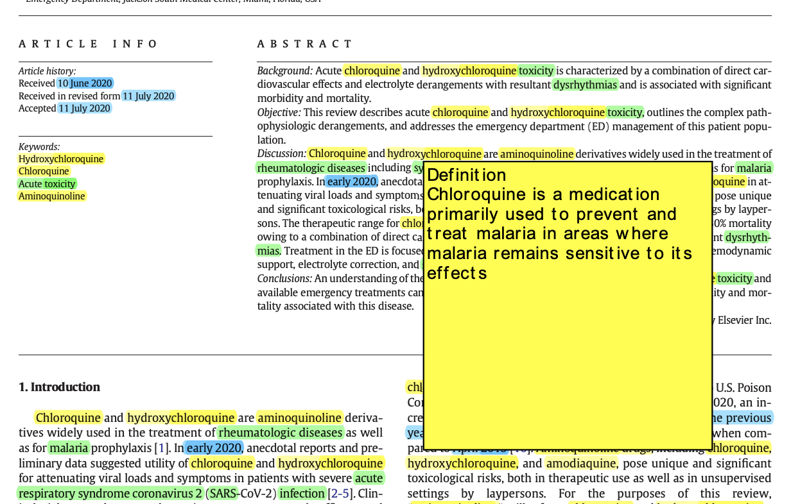

# NER in medical documents


## Installation


If you want to execute one of the files, you should do it from the parent directory of this repository. You can for example create a new python environment, place the prototype folder in it, and run it from the environment directory.

Detailed steps to avoid any problem:

- Create a new folder
- Create a new env with python 3.9.13: 
``` bash 
python3 -m venv ./test_env 
```

- Activate new env: 
``` bash 
source test_env/bin/activate
```
- Drag this repository folder in your working directory
- Install the dependencies: 
```bash 
pip3 install -r NER-Medical-Document/requirements.py
```
- If you have a warning telling you to upgrade pip, do it
- Deactivate your environment: 
```bash 
deactivate
```
- Activate it again: 
```bash
source test_env/bin/activate
```
- Now install: 
```bash 
pip3 install https://s3-us-west-2.amazonaws.com/ai2-s2-scispacy/releases/v0.4.0/en_core_sci_sm-0.4.0.tar.gz
```
- And follow the installation instructions here: https://github.com/Belval/pdf2image#how-to-install


## Usage with Streamlit


The interface is built with the [streamlit](https://streamlit.io/) library. To run the interface, you can use the following command:

```bash
streamlit run ./NER-Medical-Document/run.py
```

The interface is divided into different components:

- You can first **drag and drop or select as many files** as you want. Those files must be pdf files. The pipeline is also working with images as input though: the enities are well extracted. But the entities highlighting step is not working for now, so you won't be able visualize the results.

- Then you can choose one of the file you just uploaded. You can **view** the file, as well as its **transcription** (instead of being a pdf file, the transcription is a txt file directly embedded in streamlit).

- Finally you can **process** the file: the processing aims at detecting entities in the file. You can choose which types of entities you would like to extract with the **checkboxes**. By default, only Chemicals is selectedm you can of course choose as many as you want. Note that the more entities you choose, the longer the process.

- At the end of the processing step, you can see the **results** with the corresponding button. The detected entities are higlighted in the file. When you hover the mouse over a "Chemicals" or "Diseases" entities, a small pop-up window appears with the definition of word. For some reason, that pop-up window has a pretty bad design when it is displayed on streamlit. Depending on the pdf reader you are using, you might have a better design. See on the below image the result on streamlit (on the left) and on the vscode pdf reader (on the right).


<p float="left">
  
   
</p>


## Usage withouht Streamlit


You can now execute code without using the streamlit interface. For instance, the `extraction.py` file can be executed directly in order to get results in dictionnary. That is why there is the **streamlit_use** booleam argument now. Coreference detection is by default working only without **streamlit_use=False**.

Because of the highlighting process, which is pretty tedious and sometimes broken (see the last part of the README), I am now ignoring it and focusing on building indepent components that will be merge later.


## Structure 

I will here explain the structure of the code, the different files and their purpose.


### Input Files

The `input_files` folder contains some examples of pdf files you can drag and drop in the interface. You can also use your own files of course.


### Streamlit Interface

The streamlit interface is built in the `run.py` file. The idea is to create different individual blocks of code, that correspond to the components you want to display on the interface. Each option, each button are defined separately in the ```run()``` function. The choices of the users are saved and are used to call other parts of the code. The `run.py` file contains an other function: `process_file()` that is called when the user clicks on the "Process" button. This function is the one that calls the different parts of the pipeline, and it takes as input the path of the file and the user's choices (namely the entities to extract he wants to extract). I will dive into the different functions that are called in the `process_file()` function in the next sections.


### OCR 

When a user drags and drops a file and process it, a new folder is created in the `processed_files` folder. The name of the folder is the name of the file, and the input pdf file is stored in its corresponding folder. The OCR pipeline is then applied. The different steps are: converting the pdf into an image, applying an OCR algorithm on that image, and store the resulting txt file in the same folder as the pdf file. Note that the pdf file is divided into pages: therefore there is one image and one text file for each page of the pdf file. Those steps are coded in the `ocr.py` file.


### Entity Extraction and Highlighting

Once the OCR has been performed on the input pdf file, it is time to run the entity extraction pipeline on the text files. See the `evaluation.py` file. It is composed of 2 main functions: `extract_entities()` and `highlight_entities()`. 

- **`extract_entities()`**:  for now, there is one different model for each type of entities. I am not going into the details of the function here, I wrote more detailed information in the function itself. Again, the function takes as input the path of the text file, and the type of entities to extract. Depending on the choices, we load the corresponding models and run the entities extraction algorithms on each sentence of each text files. The results are stored in a dictionary with the following struture (see the `evaluation.py` file for more details): 

    ```python
    {'name_of_the_type_of_entity' [str]: list_of_detected_entities_in_the_whole_document [list]}
    ```

    That dictionnary is the output of the function.

- **`highlight_entities()`**: this function is used to higlight the previously extracted entities on the pdf file. It basically calls the `extract_entities()` function then go through the text and higlight the corresponding entities using a different color for each type. It is also in this function that annotations pop-ups are created. Finally, the higlighted pdf file is saved in the same folder as the input pdf file. When using the "View results" button on streamlit, it will display this file.


### Data and Models Details 

- I found some interesting datasets that can be used to finetune pre-trained models. In the `./NER-Medical-Document/data` folder, you can find an interesting dataset: `ddi_description.csv`. For more information about it, you can check out the following documentation I had written, you will find more details in the [OGB section](https://docs.google.com/document/d/1XCyWxpNDX99FOP4nDQKot8jYUEwgRlZuqrAhpBexjDA/edit#heading=h.zcohjqt1zkc8). It contains a plethora of sentences of DDI (drug-drug interactions) with the correponding drugs names in the first 2 columns. The file `data_process.py` is used to transform the data into an appropriate format to be fed into the models later. When executed, it will also split the data and create 3 files: `train.txt`, `dev.txt` and `test.txt`. 

- As I mentioned earlier, I used 4 different models (all these models are loaded directly in the `evaluation.py` file): 

  **1.  Chemicals**

    I used the [HunFlair chemical model](https://github.com/flairNLP/flair/blob/master/resources/docs/HUNFLAIR.md) for chemicals extraction. The data that I just described can be used to **finetune** this model. The performance are already good though, but might be improved. Since I have no access to a GPU at the time of writing, I did not finetune the model. The training can be performed with the `train.py` file, you just have to execute it. I have tested it on a small subset of the data, and it works. The training create a new folder: `training_results` that contains the model (`best_model.pt`) and the training logs.

  **2.  Diseases**

    I used the HunFlair disease model for this task. It is also a pre-trained model.


  **3.  Dates**

    I first wanted to use a Spacy model to detect dates (for example [en_core_web_sm](https://spacy.io/models/en#en_core_web_sm)). It leaded to some version conflicts with flair. That's why I finally decided to use a flair model again: [ner-english-ontonotes-fast](ner-english-ontonotes-fast). It comes from Hugging Face. It can detect 18 type of entities but I use it specifically for dates ()


  **4.  Adverse effects**

    Finally, I used a [hugging face model](https://huggingface.co/abhibisht89/spanbert-large-cased-finetuned-ade_corpus_v2) to detect adverse effects. It is a fine-tuned version of SpanBert on an ADE dataset. I don't know if it performs that well, but at least it looks like it makes the distinction between diseases and adverse effects. By the way, other models seems to be very promising for ADE detection ([this](https://demo.johnsnowlabs.com/healthcare/PP_ADE/) one for example). I think it is worth exploring that further. 


### Some Remarks and Possible Improvements

- **[NOT SOLVED]** As I already mentioned earlier, the pipeline is working with images too. The problem is higlighting step: even when I convert the image into a pdf file, the pdf file is not editable. Therefore, I cannot higlight the entities.

- **[NOW SOLVED BUT COULD BE IMPROVED]** There is sometimes a problem when higlighting entities. For example when an entity (let's say "Fe", the chemical symbol of iron) is present in another word (let's say "Fever"), the model will higlight "*Fe*" in the word "*Fe*ver". It is due to the fact that for each detected entity, the annotation function is searching for every occurence of it in the text. That's not a big deal, and can be solved pretty easily. I will try to figure that out.

- Other unsolvable higlighting issues and blockers: highlighting one word actually highlights all the occurences of that word, impossible to higlight a sentence which is on multiple lines (have to split the sentences into smaller portions), etc. **That's why it may be better to ignore that part of the prototype and focus on getting relevant results from the models.**

- Again, due to the lack of GPU, the performances may be reduced. If you run the streamlit interface without enough computation power, it might take a while to process large files. I tried, as far as possible, to optimize the code in order to avoid unnecessary loading, or to avoid going through the same sentences multiple times, etc. But it can surely be improved.


